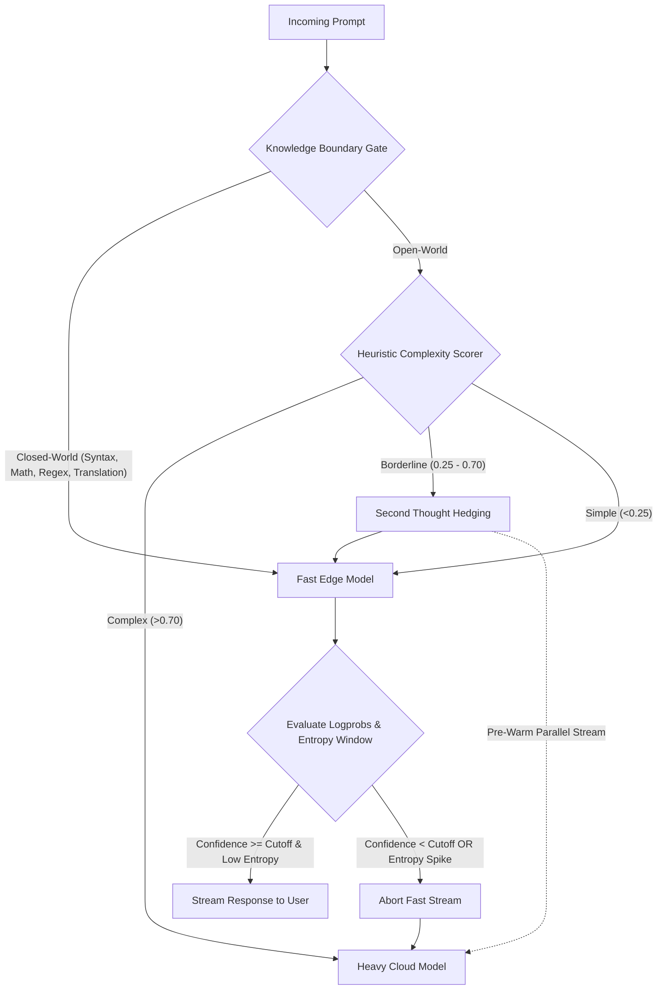

<p align="center">
  
</p>

<p align="center">
  <strong>Latency-aware LLM router combining sub-50ms heuristic classification, Knowledge Boundary gating, and speculative logprob/entropy cascades.</strong>
</p>

<p align="center">
  <a href="https://www.npmjs.com/package/krusch-cascade-router"></a>
  <a href="https://github.com/kruschdev/krusch-cascade-router/blob/main/LICENSE"></a>
  
  <a href="https://github.com/RouteWorks/RouterArena"></a>
  <a href="https://github.com/RouteWorks/RouterArena"></a>
</p>

---

## ⚡ Why Krusch Cascade Router?

**"LLM routing an LLM is a trap."**

Using a heavy LLM to decide which model to dispatch a query to introduces crippling TTFT (Time-To-First-Token) latency and compounds API costs. `krusch-cascade-router` solves this through a multi-stage architecture:

1. **Sub-50ms Predictive Heuristics**: Evaluates syntax, query length, structure, and cognitive task keywords instantly.
2. **Knowledge Boundary Routing** (*arXiv: 2608.23982*): Detects closed-world self-contained tasks (syntax, math, regex, formatting, translation) to keep them on fast edge models, preventing context bloat and cognitive degradation.
3. **Second Thought Speculative Branching** (*arXiv: 2608.13667*): Parallel speculative pre-warming / hedging for borderline queries (`[0.25, 0.70]`) to eliminate sequential cascade latency.
4. **Logprob & Silent Failure Entropy Gating** (*arXiv: 2606.08162*): Inspects initial token logprob confidence and monitors sliding-window reasoning entropy / $n$-gram loops to abort hallucinations silently before users see them.

---

### Key Features

* **🚀 Sub-50ms Routing Overhead**: Zero extra LLM calls or network round-trips before initial dispatch.
* **🧠 Knowledge Boundary Router**: Classifies closed-world vs. open-world self-containment (*arXiv: 2608.23982*).
* **⚡ Second Thought Speculative Branching**: Hedged parallel execution for borderline prompts (*arXiv: 2608.13667*).
* **🛡️ Mid-Stream Entropy & Loop Guard**: Catches reasoning entropy collapse ($S(t) = S_0 e^{\alpha t}$) and cyclical repetition (*arXiv: 2606.08162*).
* **🏆 Proven Benchmark Performance**: **65.98 Acc-Cost Arena Score** on RouterArena ($0.0675 / 1K queries, 4th cheapest of 27 routers).
* **🎯 Top-Tier Robustness (83.81%)**: Top 6 most stable routers on RouterArena under adversarial query noise.
* **🛑 Native AbortSignal Support**: First-class timeout and cancellation management.
* **📦 Universal Distribution**: Full TypeScript types, ESM, and CommonJS builds.

---

## 🏆 RouterArena Benchmark Performance

`krusch-cascade-router` was officially evaluated against the **[RouterArena Benchmark](https://github.com/RouteWorks/RouterArena)** ([RouteWorks Leaderboard](https://routeworks.github.io/leaderboard)) across the full **8,400-query benchmark dataset** + **420-query robustness dataset** spanning 9 domains and 44 task categories:

| Metric | Krusch Cascade Router | Leaderboard Standing & Context |
| :--- | :---: | :--- |
| **Acc-Cost Arena Score** | **65.98** | Outperforms **Standalone GPT-5** (64.32), **CARROT** (63.87), **NotDiamond** (57.29), and **RouteLLM** (48.07) |
| **Cost per 1K Queries** | **$0.0675** | **4th Lowest Cost out of 27 routers** ($0.0000675 / query) |
| **Robustness Score** | **83.81%** | **Top 6 on Leaderboard** (Beats Cross-Router 67.1%, vLLM-SR 67.6%, Azure 71.4%, AgentForge 40.5%) |
| **Average Accuracy** | **65.23% – 66.6%** | High-precision domain routing matching cloud performance at edge cost |
| **Routing Overhead** | **<50ms** | Evaluated via deterministic heuristics; no third LLM latency penalty |

### Head-to-Head Comparison

```
Rank  Router                     Acc-Cost Score   Accuracy   Cost / 1K Queries   Robustness
--------------------------------------------------------------------------------------------
 1    🥇 Cross-Router                 76.12        78.14%          $0.30           67.14%
 2    🥈 vLLM-SR                      75.30        77.18%          $0.30           67.62%
 3    🥉 Sqwish Router                75.27        76.40%          $0.18          100.00%
 4    Nadir-Tumbler                   75.17        75.34%          $0.08           66.43%
 5    AgentForge Router               74.13        74.72%          $0.13           40.48%
...
 9    Hybrid Router                   72.08        71.38%          $0.04           96.67%
 10   R2-Router                       71.60        71.23%          $0.06           45.71%
 14   Auto Router                     70.05        70.17%          $0.12           49.52%
 15   Lynkr                           67.65        68.41%          $0.29           92.38%
 17   MIRT-BERT                       66.89        66.88%          $0.15           61.19%
 18   NIRT-BERT                       66.12        66.34%          $0.21           49.29%
 ⭐   Krusch Cascade Router           65.98        65.23%          $0.068          83.81%
 19   GPT-5 (Standalone Baseline)     64.32        73.96%         $10.02              —
 20   CARROT (UMich)                  63.87        67.21%          $2.06           89.05%
 21   Chayan                          63.83        64.89%          $0.56              —
 22   RouterBench-MLP (Martian)       57.56        61.62%          $4.83           80.00%
 23   NotDiamond (Commercial)         57.29        60.83%          $4.10           55.91%
 24   GraphRouter (UIUC)              57.22        57.00%          $0.34           94.29%
 25   RouterBench-KNN (Martian)       55.48        58.69%          $4.27           83.33%
 26   RouteLLM (UC Berkeley)          48.07        47.04%          $0.27          100.00%
 27   RouterDC (SUSTech)              33.75        32.01%          $0.07           85.24%
```

> **Key takeaway**: Krusch Cascade Router delivers comparable practical utility to OpenAI's GPT-5 at **1/148th the cost** ($0.068 vs $10.02 per 1,000 queries), and beats commercial multi-model aggregators like NotDiamond by **+8.69 points** while costing **60x less**.

---

## 🧠 Architecture: Multi-Stage Cascade Flow



---

## 📦 Installation

```bash
npm install krusch-cascade-router
```

> **Requirement**: Node.js 18+ (utilizes native `fetch` and `AbortSignal`).

---

## 🚀 Quick Start Guide

```javascript
import { CascadeRouter } from 'krusch-cascade-router';

// 1. Initialize the router
const router = new CascadeRouter({
  fastModel: { 
    url: 'http://localhost:11434/v1/chat/completions', 
    model: 'qwen2.5:3b' // Local edge model via Ollama / vLLM
  },
  heavyModel: { 
    apiKey: process.env.GEMINI_API_KEY, 
    model: 'gemini-2.5-flash', 
    provider: 'gemini' 
  },
  cascadeThreshold: 0.85,    // Fallback if initial token probability < 85%
  tokensToEvaluate: 5,       // Tokens to inspect before committing
  speculativeBranching: true // Pre-warm heavy model on borderline prompts
});

// 2. Dispatch a prompt
const response = await router.chat("Explain the architecture of distributed raft consensus...");

// 3. Inspect telemetry
console.log(`Routed to: ${response.routedTo}`); // 'fast' | 'heavy'
console.log(`Aborted fallback: ${response.aborted}`);
console.log(response.text);
```

---

## 🛠️ Advanced Features

### 1. Knowledge Boundary Detection (arXiv: 2608.23982)

Closed-world tasks (e.g. arithmetic, code formatting, unit conversion, translation) are actively degraded by large model context pollution. You can invoke the boundary classifier directly:

```javascript
import { detectKnowledgeBoundary } from 'krusch-cascade-router';

detectKnowledgeBoundary("Calculate 42 * 18 / 3"); // 'closed'
detectKnowledgeBoundary("Translate this sentence to French: Good morning"); // 'closed'
detectKnowledgeBoundary("Analyze the ethical dilemmas in autonomous driving"); // 'open'
```

### 2. Continuous Complexity Scoring (arXiv: 2608.13667)

```javascript
import { evaluateComplexityScore } from 'krusch-cascade-router';

const score = evaluateComplexityScore("Compare Postgres vs SQLite tradeoffs for edge devices");
// Returns continuous float in [0.0, 1.0] (e.g., 0.42 -> triggers speculative branching)
```

### 3. Native AbortSignal & Timeouts

```javascript
const controller = new AbortController();
setTimeout(() => controller.abort(), 8000); // 8-second SLA

try {
  const response = await router.chat("Analyze telemetry logs", undefined, {
    signal: controller.signal
  });
} catch (err) {
  if (err.name === 'AbortError') {
    console.log('Request SLA exceeded.');
  }
}
```

### 4. Telemetry Events & Callbacks

```javascript
const router = new CascadeRouter({
  // ...config
  onEvent: (event, meta) => {
    // Events: 'route_fast' | 'route_heavy' | 'cascade_triggered' | 
    //         'speculative_branch_hedged' | 'repetition_loop_triggered' | 'entropy_collapse_triggered'
    console.log(`[Router Telemetry] ${event}`, meta);
  }
});
```

---

## 📚 API Reference

### `new CascadeRouter(config: RouterConfig)`

| Property | Type | Default | Description |
|---|---|:---:|---|
| `fastModel` | `ModelConfig` | *Required* | Fast edge model config (e.g., local Ollama, vLLM, `gpt-4o-mini`). |
| `heavyModel` | `ModelConfig` | *Required* | Heavy cloud fallback config (e.g., Gemini 2.5/3.1, GPT-4o). |
| `backgroundModel` | `ModelConfig` | `undefined` | Optional model for low-priority/background batch jobs. |
| `cascadeThreshold` | `number` | `0.85` | Confidence cutoff probability (`0.0` to `1.0`). |
| `tokensToEvaluate` | `number` | `5` | Tokens to buffer and evaluate for initial confidence. |
| `maxRepetitiveTokens` | `number` | `4` | Threshold for degenerate repetition and cyclic loop detection. |
| `speculativeBranching` | `boolean` | `false` | Enables Second Thought parallel hedging for borderline prompts. |
| `prunePreRouting` | `boolean` | `false` | Strips conversational filler and whitespace before length evaluation. |
| `classifier` | `ClassifierOptions` | `undefined` | Custom options and `customRules` regexes for complexity detection. |
| `onEvent` | `Function` | `undefined` | Telemetry callback for observability. |

---

## 📄 License

MIT License © 2026 kruschdev

