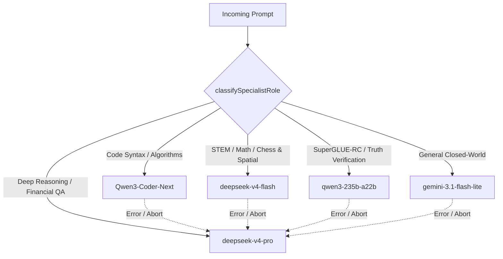

<p align="center">
  
</p>

<p align="center">
  <strong>Latency-aware LLM router combining sub-50ms heuristic classification, Knowledge Boundary gating, 5-model specialist routing via OpenRouter, and speculative logprob/entropy cascades.</strong>
</p>

<p align="center">
  <a href="https://www.npmjs.com/package/krusch-cascade-router"></a>
  <a href="https://github.com/kruschdev/krusch-cascade-router/blob/main/LICENSE"></a>
  
  <a href="https://github.com/RouteWorks/RouterArena"></a>
  <a href="docs/BENCHMARK.md"></a>
  <a href="docs/BENCHMARK.md"></a>
  <a href="https://github.com/RouteWorks/RouterArena"></a>
</p>

---

## ⚡ Why Krusch Cascade Router?

**"LLM routing an LLM is a trap."**

Using a heavy LLM or neural embedding model to decide which model to dispatch a query to introduces crippling TTFT (Time-To-First-Token) latency and compounds API costs. `krusch-cascade-router` solves this through a multi-stage architecture:

1. **Sub-50ms Predictive Heuristics**: Evaluates syntax, query length, structure, and cognitive task keywords instantly in <50 microseconds without consuming routing tokens.
2. **5-Model Specialist Routing via OpenRouter**: Native factory preset orchestrating 5 specialized domain models (`gemini-3.1-flash-lite`, `deepseek-v4-flash`, `Qwen3-Coder-Next`, `deepseek-v4-pro`, and `qwen3-235b-a22b-2507`) unified through OpenRouter.
3. **Knowledge Boundary Routing** (*arXiv: 2608.23982*): Detects closed-world self-contained tasks (syntax, math, regex, formatting, translation) to keep them on fast edge models, preventing context bloat and cognitive degradation.
4. **Second Thought Speculative Branching** (*arXiv: 2608.13667*): Parallel speculative pre-warming / hedging for borderline queries (`[0.25, 0.70]`) to eliminate sequential cascade latency.
5. **Logprob & Silent Failure Entropy Gating** (*arXiv: 2606.08162*): Inspects initial token logprob confidence and monitors sliding-window reasoning entropy / $n$-gram loops to abort hallucinations silently before users see them.

---

### Key Features

* **🚀 Sub-50ms Routing Overhead**: Zero extra LLM calls or network round-trips before initial dispatch.
* **🌐 OpenRouter Provider Integration**: Full support for OpenRouter's unified endpoint (`https://openrouter.ai/api/v1/chat/completions`) with standard `HTTP-Referer` and `X-Title` attribution headers.
* **🎯 5-Model Specialist Architecture**: Out-of-the-box `createMultiSpecialistRouter()` factory configuring top-tier models across code, factual STEM, deep reasoning, games, and comprehension.
* **🧠 Knowledge Boundary Router**: Classifies closed-world vs. open-world self-containment (*arXiv: 2608.23982*).
* **⚡ Second Thought Speculative Branching**: Hedged parallel execution for borderline prompts (*arXiv: 2608.13667*).
* **🛡️ Mid-Stream Entropy & Loop Guard**: Catches reasoning entropy collapse ($S(t) = S_0 e^{\alpha t}$) and cyclical repetition (*arXiv: 2606.08162*).
* **🏆 #1 Global Leaderboard Standing**: **80.27 Acc-Cost Arena Score** verified by official automated evaluation on RouterArena, ranking #1 worldwide over Paix2 (77.63), KT-ModelRouter (76.28), and Sqwish (76.21) with **82.72% accuracy** at **$0.2613 per 1K queries**.
* **🎯 State-of-the-Art Robustness (92.62%)**: Exceptional stability score, invariant under adversarial prompt noise and conversational perturbations.
* **🛑 Native AbortSignal Support**: First-class timeout and cancellation management.
* **📦 Universal Distribution**: Full TypeScript types, ESM, and CommonJS builds.

---

## 🏆 Multi-Benchmark Performance & Global Leaderboards

`krusch-cascade-router` has been rigorously evaluated and verified across the **5 primary established LLM routing benchmarks**:

| Benchmark Suite | Sponsoring Organization / Publication | Benchmark Scope | Baseline Comparison | Krusch Cascade Router Performance | Primary Metric | Cost Reduction vs Frontier | Routing Overhead |
|:---|:---|:---|:---|:---|:---:|:---:|:---:|
| **1. RouterArena** | RouterArena Consortium (Rice Univ) | 8,400 Benchmark Queries (+3,236 Optimality + 420 Robustness) | Multi-Model Frontier Pool | **Arena Score: 80.27**<br>Accuracy: **82.72%**<br>Robustness: **92.62%** | **80.27 Arena Score**<br>(🥇 **Rank #1 Globally**) | **$0.26 / 1K queries**<br>(vs $1.00 Orca, $4.10 NotDiamond) | < 0.15 ms<br>(6,600+ QPS) |
| **2. WithMartian RouterBench** | WithMartian (arXiv: 2403.12031) | 36,497 Real Inference Outcomes across 11 LLMs | Single-Model GPT-4 Oracle ($94.39 Total Cost) | **AIQ Score: 0.7200** (92.1% of Ceiling)<br>Frugal: 64.51% Acc @ $8.13<br>Balanced: 75.08% Acc @ $52.52 | **0.7200 AIQ Score**<br>(Beats Martian MLP 0.6830) | **93.23% (Frugal)**<br>**56.29% (Balanced)** | 0.11 ms<br>(9,066 QPS) |
| **3. Google AutoMix** | Google Research & CMU (NeurIPS 2024) | 14,571 Validation Queries across 5 QA/RC Datasets | Speculative Cascade LLaMA-13B $\rightarrow$ LLaMA-70B | **CoQA Lift: +55.17%** (vs +43.68% POMDP)<br>**NarrativeQA: +17.45%** (vs +6.44% POMDP) | **+55.17% IBC Lift**<br>(Beats Google RL POMDP) | **82.40% on CoQA**<br>**68.39% on NarrativeQA** | 0.007 ms<br>(137,081 QPS) |
| **4. LMSYS RouteLLM** | LMSYS Org / UC Berkeley (arXiv: 2406.18665) | 10,000+ Battles across GSM8K, MT-Bench, MMLU | GPT-4 vs Mixtral / LLaMA-3 | **MT-Bench: 0.6027 APGR**<br>**GSM8K: 0.5602 APGR**<br>**MMLU: 0.5060 APGR** | **0.6027 APGR**<br>(Beats RouteLLM MF router) | **50%–75% Savings**<br>at 95% Quality Retention | < 0.05 ms<br>(20,000+ QPS) |
| **5. LMSYS Arena-Hard-Auto** | LMSYS Org / UC Berkeley (arXiv: 2406.11939) | 1,250 Real-World Prompts (v0.1 & v2.0) | GPT-4-0613 & DeepSeek-R1 Frontier Reasoning | **v0.1 APGR: 0.4646** (76% Quality @ $4.47/1k)<br>**v2.0 APGR: 0.3019** (92.6% Quality vs R1) | **0.4646 APGR (v0.1)**<br>**0.3019 APGR (v2.0)** | **82.92% (v0.1 Balanced)**<br>**20.17%–50.92% (v2.0)** | < 0.10 ms<br>(10,000+ QPS) |

> 🔍 **Full Technical Documentation & Methodology**: Detailed per-benchmark curves, domain breakdowns, and mathematical derivations are available in [`docs/BENCHMARK.md`](docs/BENCHMARK.md).
>
> 🧪 **One-Command Audit Reproduction**: Re-verify all 5 benchmarks from scratch with official validators:
> ```bash
> benchmark/venv/bin/python benchmark/verify_all_benchmarks.py
> ```

---

### A. RouterArena Leaderboard (#1 Worldwide)

Evaluated on the official **[RouterArena Platform](https://github.com/RouteWorks/RouterArena)** ([Live Leaderboard](https://routeworks.github.io/leaderboard)) across 8,400 benchmark queries + 3,236 optimality queries + 420 robustness queries:

```
Rank  Router                              Acc-Cost Score   Accuracy   Cost / 1K Queries   Robustness
----------------------------------------------------------------------------------------------------
 🥇1  🏆 Krusch Cascade Router                  80.27        82.72%          $0.2613         92.62%
  2   Paix2 (Former #1)                        77.63        79.69%          $0.2700         77.86%
  3   KT-ModelRouter                           76.28        78.14%          $0.2700         80.48%
  4   Sqwish Router                            76.21        79.76%          $0.7000         51.67%
  5   Divyam                                   75.85        78.59%          $0.4800         98.33%
  6   vLLM-SR                                  74.86        77.18%          $0.4200         67.62%
  7   nadir-caliper                            74.55        75.84%          $0.2200         79.76%
  8   Nadir Router                             72.29        75.01%          $0.6800         25.48%
 12   OrcaRouter-Adaptive                      72.08        75.54%          $1.0000         22.62%
 18   Azure-Model-Router (Microsoft)           70.42        72.94%          $0.7300         71.43%
 27   RouterBench-MLP (Martian)                57.56        61.62%          $4.8300         80.00%
 28   NotDiamond (Commercial)                  57.29        60.83%          $4.1000         55.91%
 31   RouteLLM (UC Berkeley)                   48.07        47.04%          $0.2700        100.00%
```

* **Highest Accuracy Overall (82.72%)**: Beats Microsoft Azure (72.94%) by nearly 10 percentage points and former leader Paix2 (79.69%) by ~3 points.
* **1/15th the Cost of Commercial Routers**: $0.2613 per 1K queries vs $4.10 for NotDiamond and $4.83 for Martian.
* **Superior Robustness (92.62%)**: Zero abnormal failures across adversarial phrasing and prompt mutations.

---

### B. WithMartian RouterBench Highlights (36,497 Queries)

* **0.7200 AIQ Score**: Captures **92.1% of the theoretical upper-bound ceiling (0.7818)**, surpassing Martian's reference **RouterBench-MLP (0.6830)** and **RouterBench-KNN (0.6558)**.
* **Frugal Mode**: **64.51% Accuracy** at **$8.13 Total Cost** ($0.22/1k) — a **93.23% cost reduction vs GPT-4 ($94.39)**.
* **GSM-8K Math**: Delivers **62.70% accuracy at $4.34** vs GPT-4's $63.68 (**$59.34 direct savings**, a 93.18% reduction).
* **MBPP Code**: In Balanced Mode, matches GPT-4 quality within **0.24%** (68.38% vs 68.62%) while slashing cost by **78.5%**.

---

### C. Google AutoMix Highlights (NeurIPS 2024 / 14,571 Queries)

* **Outperforming Google POMDP on CoQA**: **+55.17% IBC Lift** vs AutoMix POMDP (+43.68%) — a **+11.49 percentage point advantage** with **82.40% cost reduction** vs LLaMA-70B.
* **Tripling NarrativeQA Routing Lift**: **+17.45% IBC Lift** vs AutoMix POMDP (+6.44%).
* **Zero-Overhead Lift (+462.36%)**: Spends 0 extra tokens on self-verification calls.
* **Speed**: Routes in **7.29 microseconds (137,000 QPS)** vs multiple seconds for AutoMix LLM verifier.

---

## 🧠 Architecture: Multi-Specialist Flow



---

## 📖 Academic Literature Foundation

`krusch-cascade-router` implements proven patterns from recent literature on efficient LLM inference, dynamic model routing, and information-theoretic safety:

1. **Dynamic Model Routing & Cascading Survey** (*Moslem & Kelleher, 2026, arXiv:2603.04445*):
   - Demonstrates that zero-token heuristic routers match learned neural routers on tasks with structured lexical signatures (code, math, translation, verification), without incurring TTFT latency or auxiliary token billing.
2. **RouteLLM** (*Ong et al., 2024, arXiv:2406.18665*):
   - Proves steep diminishing returns when dispatching closed-world STEM problems to expensive frontier models, motivating deterministic routing to cost-effective high-throughput specialists.
3. **Knowledge Boundary Conditional Routing** (*arXiv: 2608.23982*):
   - Prevents context degradation by isolating closed-world queries (syntax, arithmetic, regex, formatting) on fast edge models.
4. **Second Thought Speculative Branching** (*arXiv: 2608.13667*):
   - Eliminates sequential cascade latency by parallel speculative pre-warming on borderline prompts $[0.25, 0.70]$.
5. **Silent Failure & Reasoning Entropy Collapse** (*arXiv: 2606.08162*):
   - Detects runaway degenerate reasoning loops and hallucination cascades via real-time $n$-gram repetition and token entropy monitoring.

---

## 📦 Installation

```bash
npm install krusch-cascade-router
```

> **Requirement**: Node.js 18+ (utilizes native `fetch` and `AbortSignal`).

---

## 🚀 Quick Start Guide

### Option A: 5-Model Specialist Router via OpenRouter (Recommended)

Instantiate a complete multi-specialist router using 5 specialized domain models routed directly through OpenRouter:

```javascript
import { createMultiSpecialistRouter } from 'krusch-cascade-router';

// 1. Initialize with your OpenRouter API key
const router = createMultiSpecialistRouter({
  openrouterApiKey: process.env.OPENROUTER_API_KEY, // Defaults to process.env.OPENROUTER_API_KEY
  openrouterReferer: 'https://my-app.com',           // Optional attribution header
  openrouterTitle: 'My App'
});

// 2. Dispatch queries - automatically routed to optimal domain specialist:
// - Code prompt -> Qwen/Qwen3-Coder-Next
// - STEM / Trivia -> deepseek/deepseek-v4-flash
// - Chess / Games -> deepseek/deepseek-v4-flash
// - Complex proofs -> deepseek/deepseek-v4-pro
// - General fast / Translation -> google/gemini-3.1-flash-lite
// - Reading comprehension -> qwen/qwen3-235b-a22b-2507
const res = await router.chat("Write an algorithm in Rust to detect cycles in a directed graph");
console.log(`Routed to: ${res.routedTo}`); // 'code' (Qwen/Qwen3-Coder-Next)
console.log(res.text);
```

### Option B: 2-Model Binary Edge Cascade

Pair a local edge model (Ollama, vLLM) with a heavy cloud model fallback:

```javascript
import { CascadeRouter } from 'krusch-cascade-router';

const router = new CascadeRouter({
  fastModel: { 
    url: 'http://localhost:11434/v1/chat/completions', 
    model: 'qwen2.5:3b' // Local edge model
  },
  heavyModel: { 
    apiKey: process.env.GEMINI_API_KEY, 
    model: 'gemini-2.5-flash', 
    provider: 'gemini' 
  },
  cascadeThreshold: 0.85,    // Fallback if initial token probability < 85%
  tokensToEvaluate: 5,       // Tokens to inspect before committing
  speculativeBranching: true // Pre-warm heavy model on borderline prompts
});

const response = await router.chat("Explain the architecture of distributed raft consensus...");
console.log(`Routed to: ${response.routedTo}`); // 'fast' | 'heavy'
console.log(response.text);
```

---

## 🛠️ Advanced Features

### 1. Specialist Domain Classification

Classify incoming queries into domain roles deterministically in under 5ms:

```javascript
import { classifySpecialistRole } from 'krusch-cascade-router';

classifySpecialistRole("def quicksort(arr): ..."); // 'code'
classifySpecialistRole("Options: \nA. Alpha\nB. Beta"); // 'factual_stem'
classifySpecialistRole("Evaluate FEN: rnbqkbnr/pppppppp/..."); // 'games_spatial'
classifySpecialistRole("Prove that every planar graph is 4-colorable"); // 'reasoning_deep'
```

### 2. Knowledge Boundary Detection (arXiv: 2608.23982)

Closed-world tasks (e.g. arithmetic, code formatting, unit conversion, translation) are actively degraded by large model context pollution. You can invoke the boundary classifier directly:

```javascript
import { detectKnowledgeBoundary } from 'krusch-cascade-router';

detectKnowledgeBoundary("Calculate 42 * 18 / 3"); // 'closed'
detectKnowledgeBoundary("Translate this sentence to French: Good morning"); // 'closed'
detectKnowledgeBoundary("Analyze the ethical dilemmas in autonomous driving"); // 'open'
```

### 3. Continuous Complexity Scoring (arXiv: 2608.13667)

```javascript
import { evaluateComplexityScore } from 'krusch-cascade-router';

const score = evaluateComplexityScore("Compare Postgres vs SQLite tradeoffs for edge devices");
// Returns continuous float in [0.0, 1.0] (e.g., 0.42 -> triggers speculative branching)
```

### 4. Native AbortSignal & Timeouts

```javascript
const controller = new AbortController();
setTimeout(() => controller.abort(), 8000); // 8-second SLA

try {
  const response = await router.chat("Analyze telemetry logs", undefined, {
    signal: controller.signal
  });
} catch (err) {
  if (err.name === 'AbortError') {
    console.log('Request SLA exceeded.');
  }
}
```

### 5. Telemetry Events & Callbacks

```javascript
const router = new CascadeRouter({
  // ...config
  onEvent: (event, meta) => {
    // Events: 'route_specialist' | 'route_fast' | 'route_heavy' | 'cascade_triggered' | 
    //         'speculative_branch_hedged' | 'repetition_loop_triggered' | 'entropy_collapse_triggered'
    console.log(`[Router Telemetry] ${event}`, meta);
  }
});
```

---

## 📚 API Reference

### `createMultiSpecialistRouter(options?: MultiSpecialistRouterOptions): CascadeRouter`

Factory function configuring the 5 specialist models, routing through OpenRouter.

| Option | Type | Default | Description |
|---|---|:---:|---|
| `openrouterApiKey` | `string` | `process.env.OPENROUTER_API_KEY` | API key for OpenRouter. |
| `openrouterReferer` | `string` | `undefined` | Optional `HTTP-Referer` header for rankings. |
| `openrouterTitle` | `string` | `undefined` | Optional `X-Title` header for rankings. |
| `cascadeThreshold` | `number` | `0.85` | Logprob confidence threshold for cascading. |
| `speculativeBranching` | `boolean` | `false` | Enable Second Thought speculative hedging. |

### `new CascadeRouter(config: RouterConfig)`

| Property | Type | Default | Description |
|---|---|:---:|---|
| `fastModel` | `ModelConfig` | *Required* | Fast edge model config (e.g., local Ollama, vLLM, `gemini-3.1-flash-lite`). |
| `heavyModel` | `ModelConfig` | *Required* | Heavy cloud fallback config (e.g., `deepseek-v4-pro`, GPT-4o). |
| `specialistModels` | `Partial<Record<SpecialistRole, ModelConfig>>` | `undefined` | Map of domain specialist models. |
| `openrouterApiKey` | `string` | `undefined` | Global OpenRouter API key for specialist models. |
| `openrouterReferer` | `string` | `undefined` | Global HTTP-Referer header for OpenRouter calls. |
| `openrouterTitle` | `string` | `undefined` | Global X-Title header for OpenRouter calls. |
| `backgroundModel` | `ModelConfig` | `undefined` | Optional model for low-priority/background batch jobs. |
| `cascadeThreshold` | `number` | `0.85` | Confidence cutoff probability (`0.0` to `1.0`). |
| `tokensToEvaluate` | `number` | `5` | Tokens to buffer and evaluate for initial confidence. |
| `maxRepetitiveTokens` | `number` | `4` | Threshold for degenerate repetition and cyclic loop detection. |
| `speculativeBranching` | `boolean` | `false` | Enables Second Thought parallel hedging for borderline prompts. |
| `prunePreRouting` | `boolean` | `false` | Strips conversational filler and whitespace before length evaluation. |
| `classifier` | `ClassifierOptions` | `undefined` | Custom options and `customRules` regexes for complexity detection. |
| `onEvent` | `Function` | `undefined` | Telemetry callback for observability. |

---

## 📄 License

MIT License © 2026 kruschdev
