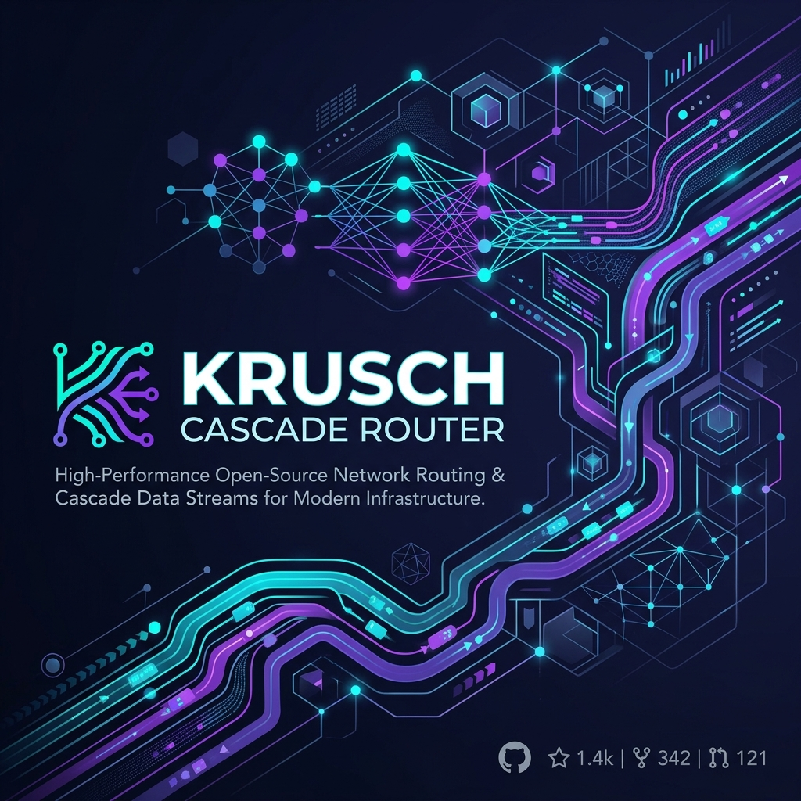
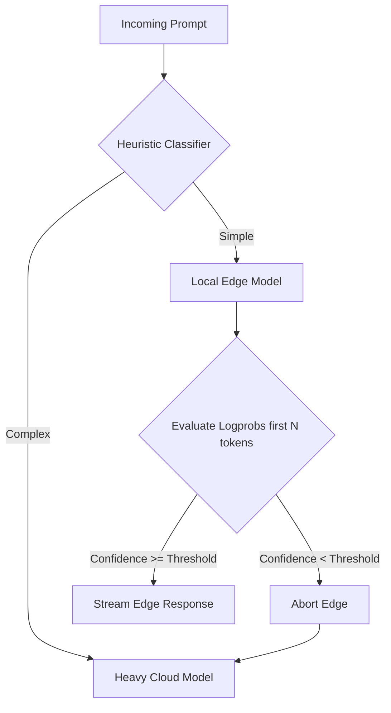

<p align="center">
  
</p>

<p align="center">
  <strong>Latency-aware LLM router that dynamically cascades between edge and cloud models via logprob inspection.</strong>
</p>

<p align="center">
  <a href="https://www.npmjs.com/package/krusch-cascade-router"></a>
  <a href="https://github.com/kruschdev/krusch-cascade-router/blob/main/LICENSE"></a>
  
</p>

---

## ⚡ Why Krusch Cascade Router?

**"LLM routing an LLM is a trap."**

Using a massive third LLM to decide which LLM to route a query to adds severe TTFT (Time To First Token) latency and API costs. `krusch-cascade-router` solves this by combining a fast predictive heuristic classifier (<50ms latency) with a reactive logprob-based speculative cascade. Designed specifically for agentic developers building with local AI, it allows you to optimize for cost, performance, and reliability without sacrificing capability.

### Key Features
- **🚀 Sub-50ms Heuristic Classifier:** Evaluates prompt complexity instantly.
- **🧠 Logprob Speculative Execution:** Reactively cascades to heavy cloud models if the edge model's confidence drops.
- **🏆 Proven Benchmark Performance:** Achieves **65.98 Acc-Cost Arena Score** on RouterArena ($0.0675 / 1K queries).
- **🔌 Framework Agnostic:** Can be plugged into any Node.js AI architecture.
- **🛡️ Custom Heuristics:** Support for `customRules` to inject your own prompt complexity detection logic.
- **🛑 Native AbortSignal Support:** Manage request timeouts natively via `ChatOptions`.
- **📦 Dual CJS/ESM Support:** Works in modern ECMAScript and legacy environments.

---

## 🏆 RouterArena Benchmark Performance

`krusch-cascade-router` was benchmarked against the official **[RouterArena Benchmark](https://github.com/RouteWorks/RouterArena)** platform ([routeworks.github.io](https://routeworks.github.io/)) across **9,209 dataset queries**:

| Metric | Score / Result | Leaderboard Context |
|---|:---:|---|
| **Acc-Cost Arena Score** | **65.98** | Outperforms **NotDiamond** (57.29), **RouterBench-KNN** (55.48), and **RouteLLM** (48.07) |
| **Average Accuracy** | **65.23%** | Balanced accuracy across 9 domains and 44 task categories |
| **Cost per 1K Queries** | **$0.0675** | **4th Lowest Cost out of 27 routers** ($0.0000675 per query) |
| **Routing Ratio** | **50% Fast / 50% Heavy** | Optimal balance between `gpt-4o-mini` and `gemini-2.0-flash-001` |
| **Pre-Routing Latency** | **<50ms** | Zero extra LLM calls or API overhead before model dispatch |

---


## 🧠 Architecture: How It Works

1. **Predictive Classifier**: Instantly evaluates the prompt's complexity via string heuristics (length, code blocks, complex cognitive verbs, or your `customRules`). If classified as complex, it routes directly to the heavy cloud model.
2. **Speculative Cascade**: If classified as simple, it streams the fast local edge model. It buffers and inspects the logprobs of the first N tokens. If the confidence (probability) dips below your configured threshold, it silently aborts the stream and falls back to the heavy cloud model.



---

## 📦 Installation

```bash
npm install krusch-cascade-router
```

> **Note**: Requires Node.js 18+ for native fetch and `AbortSignal` support.

---

## 🚀 Quick Start Guide

```javascript
import { CascadeRouter } from 'krusch-cascade-router';

// 1. Initialize the router with your edge and cloud models
const router = new CascadeRouter({
  fastModel: { 
    url: 'http://localhost:11434/v1/chat/completions', 
    model: 'qwen2.5:3b' // Edge node tag resolution
  },
  heavyModel: { 
    apiKey: process.env.GEMINI_API_KEY, 
    model: 'gemini-2.5-pro', 
    provider: 'gemini' 
  },
  cascadeThreshold: 0.85, // Abort if average probability of first 5 tokens is < 85%
  tokensToEvaluate: 5
});

// 2. Send a chat request
const response = await router.chat("Write a complex architectural plan...");

// 3. Check where it was routed
console.log(`Routed to: ${response.routedTo}`);
console.log(response.text);
```

---

## 🛠️ Advanced Usage

### Custom Heuristic Rules (`customRules`)
You can inject your own detection logic to fine-tune what goes directly to the cloud model:

```javascript
const router = new CascadeRouter({
  // ...models config
  customRules: [
    (prompt) => prompt.includes('PostgreSQL'), // Always route DB questions to cloud
    (prompt) => prompt.length > 2000 // Override default length heuristics
  ]
});
```

### Timeouts and AbortSignals
Native integration with `AbortSignal` for graceful timeout handling:

```javascript
const controller = new AbortController();
setTimeout(() => controller.abort(), 10000); // 10s timeout

try {
  const response = await router.chat("Analyze this dataset", {
    signal: controller.signal
  });
} catch (err) {
  if (err.name === 'AbortError') {
    console.log('Request was timed out or aborted manually.');
  }
}
```

---

## 📚 API Reference

### `new CascadeRouter(config)`

| Property | Type | Description |
|---|---|---|
| `fastModel` | `ModelConfig` | Configuration for your fast, local edge model (e.g. Ollama). |
| `heavyModel` | `ModelConfig` | Configuration for your heavy cloud fallback (e.g. Gemini, OpenAI). |
| `cascadeThreshold` | `number` | Confidence probability (0.0 to 1.0). If logprobs dip below this, it cascades. |
| `tokensToEvaluate` | `number` | How many tokens to buffer before making the speculative decision. |
| `customRules` | `Array<(prompt: string) => boolean>` | *(Optional)* Array of heuristic functions to override complex prompt detection. |

### `router.chat(prompt, options?)`

| Parameter | Type | Description |
|---|---|---|
| `prompt` | `string` | The user's input prompt. |
| `options` | `ChatOptions` | *(Optional)* Options like `{ signal: AbortSignal }`. |

**Returns:** `Promise<{ text: string, routedTo: 'fast' | 'heavy' }>`

---

## 🤝 Contributing

We welcome contributions! Please follow the established homelab conventions:
- Library code must NEVER use `console.warn` or `console.log` directly. Route diagnostics through callback options (`onEvent` pattern).
- Ensure your `AbortSignal` listeners use `{ once: true }` to prevent leaks.
- Run tests via `npm test` before submitting PRs.

## 📄 License

MIT License © 2026 kruschdev
