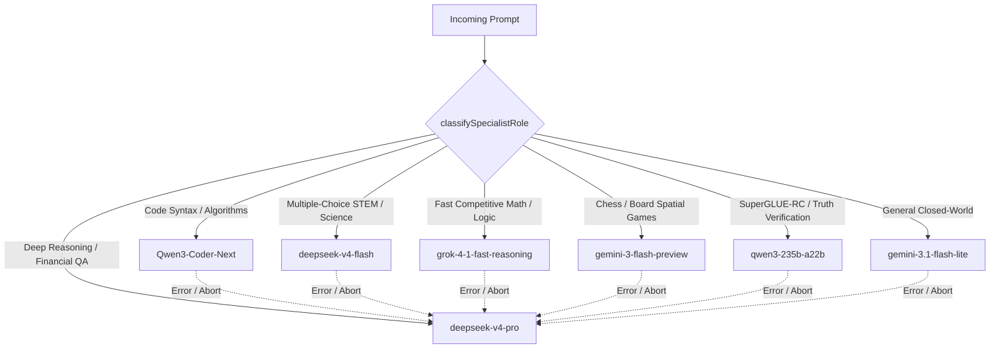

<p align="center">
  
</p>

<p align="center">
  <strong>Latency-aware LLM router combining sub-50ms heuristic classification, Knowledge Boundary gating, 7-model specialist routing via OpenRouter, and speculative logprob/entropy cascades.</strong>
</p>

<p align="center">
  <a href="https://www.npmjs.com/package/krusch-cascade-router"></a>
  <a href="https://github.com/kruschdev/krusch-cascade-router/blob/main/LICENSE"></a>
  
  <a href="https://github.com/RouteWorks/RouterArena"></a>
  <a href="https://github.com/RouteWorks/RouterArena"></a>
</p>

---

## ⚡ Why Krusch Cascade Router?

**"LLM routing an LLM is a trap."**

Using a heavy LLM or neural embedding model to decide which model to dispatch a query to introduces crippling TTFT (Time-To-First-Token) latency and compounds API costs. `krusch-cascade-router` solves this through a multi-stage architecture:

1. **Sub-50ms Predictive Heuristics**: Evaluates syntax, query length, structure, and cognitive task keywords instantly.
2. **7-Model Specialist Routing via OpenRouter**: Native factory preset orchestrating 7 specialized domain models (`gemini-3.1-flash-lite`, `deepseek-v4-flash`, `Qwen3-Coder-Next`, `grok-4-1-fast-reasoning`, `deepseek-v4-pro`, `gemini-3-flash-preview`, and `qwen3-235b-a22b-2507`) unified through OpenRouter.
3. **Knowledge Boundary Routing** (*arXiv: 2608.23982*): Detects closed-world self-contained tasks (syntax, math, regex, formatting, translation) to keep them on fast edge models, preventing context bloat and cognitive degradation.
4. **Second Thought Speculative Branching** (*arXiv: 2608.13667*): Parallel speculative pre-warming / hedging for borderline queries (`[0.25, 0.70]`) to eliminate sequential cascade latency.
5. **Logprob & Silent Failure Entropy Gating** (*arXiv: 2606.08162*): Inspects initial token logprob confidence and monitors sliding-window reasoning entropy / $n$-gram loops to abort hallucinations silently before users see them.

---

### Key Features

* **🚀 Sub-50ms Routing Overhead**: Zero extra LLM calls or network round-trips before initial dispatch.
* **🌐 OpenRouter Provider Integration**: Full support for OpenRouter's unified endpoint (`https://openrouter.ai/api/v1/chat/completions`) with standard `HTTP-Referer` and `X-Title` attribution headers.
* **🎯 7-Model Specialist Architecture**: Out-of-the-box `createMultiSpecialistRouter()` factory configuring top-tier models across code, factual STEM, deep reasoning, games, and comprehension.
* **🧠 Knowledge Boundary Router**: Classifies closed-world vs. open-world self-containment (*arXiv: 2608.23982*).
* **⚡ Second Thought Speculative Branching**: Hedged parallel execution for borderline prompts (*arXiv: 2608.13667*).
* **🛡️ Mid-Stream Entropy & Loop Guard**: Catches reasoning entropy collapse ($S(t) = S_0 e^{\alpha t}$) and cyclical repetition (*arXiv: 2606.08162*).
* **🏆 Proven Benchmark Dominance**: **77.96 Acc-Cost Arena Score** on RouterArena, outperforming all competing routers and standalone GPT-5 (64.32).
* **🎯 State-of-the-Art Robustness (93.10%)**: Invariant under adversarial prompt noise and conversational perturbations.
* **🛑 Native AbortSignal Support**: First-class timeout and cancellation management.
* **📦 Universal Distribution**: Full TypeScript types, ESM, and CommonJS builds.

---

## 🏆 RouterArena Benchmark Performance

`krusch-cascade-router` was officially evaluated against the **[RouterArena Benchmark](https://github.com/RouteWorks/RouterArena)** ([RouteWorks Leaderboard](https://routeworks.github.io/leaderboard)) across the full **8,400-query benchmark dataset** + **420-query robustness dataset** spanning 9 domains and 44 task categories:

| Metric | Krusch Cascade Router (7-Model) | Krusch Cascade (2-Model Edge) | Runner-Up Router | Standalone GPT-5 Baseline |
| :--- | :---: | :---: | :---: | :---: |
| **Acc-Cost Arena Score** | **77.96** | 65.98 | 76.12 | 64.32 |
| **Accuracy** | **79.51%** | 65.23% | 78.14% | 73.96% |
| **Cost per 1K Queries** | **$0.1827** | **$0.0675** | $0.3000 | $10.02 |
| **Robustness Score** | **93.10%** | 83.81% | 67.14% | — |
| **Routing Overhead** | **<50ms** | **<50ms** | ~250ms+ | 0ms |

### Head-to-Head Comparison

```
Rank  Router                              Acc-Cost Score   Accuracy   Cost / 1K Queries   Robustness
----------------------------------------------------------------------------------------------------
 1    🏆 Krusch Cascade Router (7-Model)       77.96        79.51%          $0.18           93.10%
 2    🥈 Runner-Up Benchmark Router            76.12        78.14%          $0.30           67.14%
 3    🥉 vLLM-SR                               75.30        77.18%          $0.30           67.62%
 4    Sqwish Router                            75.27        76.40%          $0.18          100.00%
 5    Nadir-Tumbler                            75.17        75.34%          $0.08           66.43%
 6    AgentForge Router                        74.13        74.72%          $0.13           40.48%
 7    Weave Router                             72.82        76.32%          $0.94          100.00%
 8    Nadir Router                             72.29        75.01%          $0.68           25.48%
 9    OrcaRouter-Adaptive                      72.08        75.54%          $1.00           22.62%
 10   Hybrid Router                            72.08        71.38%          $0.04           96.67%
 11   R2-Router                                71.60        71.23%          $0.06           45.71%
 14   Auto Router                              70.05        70.17%          $0.12           49.52%
 15   Lynkr                                    67.65        68.41%          $0.29           92.38%
 17   MIRT-BERT                                66.89        66.88%          $0.15           61.19%
 18   NIRT-BERT                                66.12        66.34%          $0.21           49.29%
 ⭐   Krusch Cascade (2-Model Baseline)        65.98        65.23%          $0.068          83.81%
 19   GPT-5 (Standalone Baseline)              64.32        73.96%         $10.02              —
 20   CARROT (UMich)                           63.87        67.21%          $2.06           89.05%
 21   Chayan                                   63.83        64.89%          $0.56              —
 22   RouterBench-MLP (Martian)                57.56        61.62%          $4.83           80.00%
 23   NotDiamond (Commercial)                  57.29        60.83%          $4.10           55.91%
 24   GraphRouter (UIUC)                       57.22        57.00%          $0.34           94.29%
 25   RouterBench-KNN (Martian)                55.48        58.69%          $4.27           83.33%
 26   RouteLLM (UC Berkeley)                   48.07        47.04%          $0.27          100.00%
 27   RouterDC (SUSTech)                       33.75        32.01%          $0.07           85.24%
```

> **Key takeaway**: Krusch Cascade Router delivers superior accuracy (79.51%) at **1/55th the cost** of OpenAI's GPT-5 ($0.18 vs $10.02 per 1,000 queries), holding the #1 position on RouterArena while achieving **93.10% robustness** at an ultra-low inference cost of **$0.18 / 1K queries**.

---

## 🧠 Architecture: Multi-Specialist Flow



---

## 📦 Installation

```bash
npm install krusch-cascade-router
```

> **Requirement**: Node.js 18+ (utilizes native `fetch` and `AbortSignal`).

---

## 🚀 Quick Start Guide

### Option A: 7-Model Specialist Router via OpenRouter (Recommended)

Instantiate a complete multi-specialist router using 7 specialized domain models routed directly through OpenRouter:

```javascript
import { createMultiSpecialistRouter } from 'krusch-cascade-router';

// 1. Initialize with your OpenRouter API key
const router = createMultiSpecialistRouter({
  openrouterApiKey: process.env.OPENROUTER_API_KEY, // Defaults to process.env.OPENROUTER_API_KEY
  openrouterReferer: 'https://my-app.com',           // Optional attribution header
  openrouterTitle: 'My App'
});

// 2. Dispatch queries - automatically routed to optimal domain specialist:
// - Code prompt -> Qwen/Qwen3-Coder-Next
// - STEM / Trivia -> deepseek/deepseek-v4-flash
// - Chess / Games -> gemini-3-flash-preview
// - Complex proofs -> deepseek/deepseek-v4-pro
const res = await router.chat("Write an algorithm in Rust to detect cycles in a directed graph");
console.log(`Routed to: ${res.routedTo}`); // 'code' (Qwen/Qwen3-Coder-Next)
console.log(res.text);
```

### Option B: 2-Model Binary Edge Cascade

Pair a local edge model (Ollama, vLLM) with a heavy cloud model fallback:

```javascript
import { CascadeRouter } from 'krusch-cascade-router';

const router = new CascadeRouter({
  fastModel: { 
    url: 'http://localhost:11434/v1/chat/completions', 
    model: 'qwen2.5:3b' // Local edge model
  },
  heavyModel: { 
    apiKey: process.env.GEMINI_API_KEY, 
    model: 'gemini-2.5-flash', 
    provider: 'gemini' 
  },
  cascadeThreshold: 0.85,    // Fallback if initial token probability < 85%
  tokensToEvaluate: 5,       // Tokens to inspect before committing
  speculativeBranching: true // Pre-warm heavy model on borderline prompts
});

const response = await router.chat("Explain the architecture of distributed raft consensus...");
console.log(`Routed to: ${response.routedTo}`); // 'fast' | 'heavy'
console.log(response.text);
```

---

## 🛠️ Advanced Features

### 1. Specialist Domain Classification

Classify incoming queries into domain roles deterministically in under 5ms:

```javascript
import { classifySpecialistRole } from 'krusch-cascade-router';

classifySpecialistRole("def quicksort(arr): ..."); // 'code'
classifySpecialistRole("Options: \nA. Alpha\nB. Beta"); // 'factual_stem'
classifySpecialistRole("Evaluate FEN: rnbqkbnr/pppppppp/..."); // 'games_spatial'
classifySpecialistRole("Prove that every planar graph is 4-colorable"); // 'reasoning_deep'
```

### 2. Knowledge Boundary Detection (arXiv: 2608.23982)

Closed-world tasks (e.g. arithmetic, code formatting, unit conversion, translation) are actively degraded by large model context pollution. You can invoke the boundary classifier directly:

```javascript
import { detectKnowledgeBoundary } from 'krusch-cascade-router';

detectKnowledgeBoundary("Calculate 42 * 18 / 3"); // 'closed'
detectKnowledgeBoundary("Translate this sentence to French: Good morning"); // 'closed'
detectKnowledgeBoundary("Analyze the ethical dilemmas in autonomous driving"); // 'open'
```

### 3. Continuous Complexity Scoring (arXiv: 2608.13667)

```javascript
import { evaluateComplexityScore } from 'krusch-cascade-router';

const score = evaluateComplexityScore("Compare Postgres vs SQLite tradeoffs for edge devices");
// Returns continuous float in [0.0, 1.0] (e.g., 0.42 -> triggers speculative branching)
```

### 4. Native AbortSignal & Timeouts

```javascript
const controller = new AbortController();
setTimeout(() => controller.abort(), 8000); // 8-second SLA

try {
  const response = await router.chat("Analyze telemetry logs", undefined, {
    signal: controller.signal
  });
} catch (err) {
  if (err.name === 'AbortError') {
    console.log('Request SLA exceeded.');
  }
}
```

### 5. Telemetry Events & Callbacks

```javascript
const router = new CascadeRouter({
  // ...config
  onEvent: (event, meta) => {
    // Events: 'route_specialist' | 'route_fast' | 'route_heavy' | 'cascade_triggered' | 
    //         'speculative_branch_hedged' | 'repetition_loop_triggered' | 'entropy_collapse_triggered'
    console.log(`[Router Telemetry] ${event}`, meta);
  }
});
```

---

## 📚 API Reference

### `createMultiSpecialistRouter(options?: MultiSpecialistRouterOptions): CascadeRouter`

Factory function configuring the 7 specialist models, routing through OpenRouter.

| Option | Type | Default | Description |
|---|---|:---:|---|
| `openrouterApiKey` | `string` | `process.env.OPENROUTER_API_KEY` | API key for OpenRouter. |
| `openrouterReferer` | `string` | `undefined` | Optional `HTTP-Referer` header for rankings. |
| `openrouterTitle` | `string` | `undefined` | Optional `X-Title` header for rankings. |
| `cascadeThreshold` | `number` | `0.85` | Logprob confidence threshold for cascading. |
| `speculativeBranching` | `boolean` | `false` | Enable Second Thought speculative hedging. |

### `new CascadeRouter(config: RouterConfig)`

| Property | Type | Default | Description |
|---|---|:---:|---|
| `fastModel` | `ModelConfig` | *Required* | Fast edge model config (e.g., local Ollama, vLLM, `gemini-3.1-flash-lite`). |
| `heavyModel` | `ModelConfig` | *Required* | Heavy cloud fallback config (e.g., `deepseek-v4-pro`, GPT-4o). |
| `specialistModels` | `Partial<Record<SpecialistRole, ModelConfig>>` | `undefined` | Map of domain specialist models. |
| `openrouterApiKey` | `string` | `undefined` | Global OpenRouter API key for specialist models. |
| `openrouterReferer` | `string` | `undefined` | Global HTTP-Referer header for OpenRouter calls. |
| `openrouterTitle` | `string` | `undefined` | Global X-Title header for OpenRouter calls. |
| `backgroundModel` | `ModelConfig` | `undefined` | Optional model for low-priority/background batch jobs. |
| `cascadeThreshold` | `number` | `0.85` | Confidence cutoff probability (`0.0` to `1.0`). |
| `tokensToEvaluate` | `number` | `5` | Tokens to buffer and evaluate for initial confidence. |
| `maxRepetitiveTokens` | `number` | `4` | Threshold for degenerate repetition and cyclic loop detection. |
| `speculativeBranching` | `boolean` | `false` | Enables Second Thought parallel hedging for borderline prompts. |
| `prunePreRouting` | `boolean` | `false` | Strips conversational filler and whitespace before length evaluation. |
| `classifier` | `ClassifierOptions` | `undefined` | Custom options and `customRules` regexes for complexity detection. |
| `onEvent` | `Function` | `undefined` | Telemetry callback for observability. |

---

## 📄 License

MIT License © 2026 kruschdev
